# Event-Driven Ledger Allocation Engine


Backend system that processes incoming payment events and automatically allocates funds across internal ledger accounts.

## Key Features

- Event-driven webhook processing
- Idempotent event handling
- Automated ledger allocation
- PostgreSQL persistence
- RESTful API with FastAPI
- Swagger/OpenAPI documentation
- CI/CD with GitHub Actions
- Comprehensive automated test coverage

## Overview

This project is a backend system that simulates how a financial platform might process incoming payment events and distribute funds across multiple internal ledger accounts.

The application receives payment completion events through a webhook endpoint, validates and processes them, then automatically allocates the incoming funds according to predefined rules.

The focus of the project is on backend architecture and reliability patterns commonly used in payment and fintech systems, including:

* Webhook processing
* Idempotent event handling
* Service-oriented design
* Automated fund allocation
* Audit logging
* Reconciliation tracking
* External API integration patterns

This project is intended as a portfolio and learning exercise and does not connect to any real banking infrastructure.

---

## Why I Built This

Many payment systems receive funds into a central account before distributing them internally for settlement, accounting, or operational purposes.

I built this to understand how systems handle payment-like workflows where:

- Events may be retried by providers.
- Delivery is typically at-least-once rather than exactly-once.
- Processing must remain consistent even when duplicates occur.

---

## System Flow

1. A payment completion event is received through a webhook.
2. The webhook signature is validated.
3. The event is checked against the idempotency store.
4. Previously processed events are ignored.
5. The allocation engine calculates ledger distributions.
6. Internal transfer requests are generated.
7. Transfer results are stored for auditing and reconciliation.
8. The event is marked as processed.

### Processing Pipeline

```text
External Provider
        |
        v
   FastAPI API
        |
        v
 Event Processor
        |
        +----> Idempotency Store
        |
        +----> Allocation Engine
        |
        +----> PostgreSQL
```

---

## Project Structure

```text
.
├── README.md
├── .gitignore
├── .env.example
├── requirements.txt
├── docker-compose.yml
├── Dockerfile
│
├── app/
│   ├── main.py
│   ├── config.py
│   │
│   ├── db/
│   │   ├── session.py
│   │   └── base.py
│   │
│   ├── models/
│   │   ├── event.py
│   │   └── transfer.py
│   │
│   ├── schemas/
│   │   └── webhook.py
│   │
│   ├── routes/
│   │   └── webhook.py
│   │
│   ├── services/
│   │   ├── allocation_engine.py
│   │   ├── event_processor.py
│   │   ├── idempotency.py
│   │   ├── reconciliation.py
│   │   └── transfer_client.py
│   │
│   └── utils/
│       ├── logging.py
│       └── security.py
│
├── tests/
│   ├── test_allocation.py
│   ├── test_webhook.py
│   └── test_idempotency.py
│
└── docs/
    ├── architecture.md
    └── api_examples.md
    └── test-results
        └── Application_Status-Screenshots
        └── Database_Records-Screenshots
        └── SwaggerUI_Screenshots
  
```

---

## Tech Stack

* Python 3.12
* FastAPI
* PostgreSQL
* SQLAlchemy
* Docker
* Pytest
* HTTP client (Requests / httpx)
  
## Key Components

### Webhook Processing

The application exposes an endpoint for receiving payment events from an external provider. Incoming requests are validated before any business logic is executed.

### Idempotency Layer

Idempotency is enforced using the event_id. In this implementation, processed events are tracked in the database to ensure duplicate webhook deliveries do not trigger multiple allocations.

### Allocation Engine

The allocation engine is responsible for calculating how incoming funds should be distributed across internal ledger accounts.

The current implementation demonstrates allocation using configurable percentage-based rules. A simplified equal-distribution strategy is included as the default example.

### Transfer Client

Transfers are executed through a dedicated client layer that abstracts communication with external services.

This keeps provider-specific logic separate from business rules and makes future integrations easier to support.

### Audit & Reconciliation

All processed events and transfer outcomes are recorded to provide traceability and support reconciliation workflows.

---

## Example Event Payload

http://127.0.0.1:8000/docs

### Endpoint

```http
POST /webhook/events
```

### Request Body

```json
{
  "event_type": "deposit",
  "event_id": "evt_21000",
  "amount": 500000,
  "account_id": "clearing_123",
  "timestamp": "2026-06-12T10:00:00Z"
}
```

### Response (200 OK)

```json
{
  "event_id": "evt_21000",
  "allocations": {
    "ACCOUNT_A": 100000,
    "ACCOUNT_B": 100000,
    "ACCOUNT_C": 100000,
    "ACCOUNT_D": 100000,
    "ACCOUNT_E": 100000
  },
  "transfers": [
    {
      "account": "ACCOUNT_A",
      "amount": 100000,
      "transfer": {
        "transfer_id": "8c60a6e9-8841-4a0f-bc88-73775c262d4b",
        "status": "success"
      }
    },
    {
      "account": "ACCOUNT_B",
      "amount": 100000,
      "transfer": {
        "transfer_id": "5e0aeba1-d63a-4587-8ebf-886bdaa81d84",
        "status": "success"
      }
    },
    {
      "account": "ACCOUNT_C",
      "amount": 100000,
      "transfer": {
        "transfer_id": "34d5141f-60cf-42db-aa86-30ede8b5c89c",
        "status": "success"
      }
    },
    {
      "account": "ACCOUNT_D",
      "amount": 100000,
      "transfer": {
        "transfer_id": "c6d5b16b-926b-499f-b296-d719b143e31c",
        "status": "success"
      }
    },
    {
      "account": "ACCOUNT_E",
      "amount": 100000,
      "transfer": {
        "transfer_id": "edc0690f-b93f-4f38-847b-a5319222a969",
        "status": "success"
      }
    }
  ]
}
```

### Webhook Receiver

```http
POST /webhook/events
```

Receives incoming payment completion events from the external provider.

---

## Running Locally

### Clone the Repository

```bash
git clone https://github.com/mwapevi/Event-Driven-Ledger-Allocation-Engine.git
cd Event-Driven-Ledger-Allocation-Engine
```

### Configure Environment Variables

```bash
cp .env.example .env
```

Update the environment variables as needed.

### Start the Application

```bash
docker-compose up --build
```

### Access the Service

```text
API:  http://localhost:8000
Docs: http://localhost:8000/docs
```

---

## Running Tests

```bash
pytest
```

Current test coverage focuses on:

* Allocation calculations
* Webhook processing
* Idempotency behavior
* Service-level business logic

---

## Application Screenshots

The screenshots below demonstrate successful API execution, database persistence, and application health verification.

### Swagger UI

Interactive API documentation generated by FastAPI.

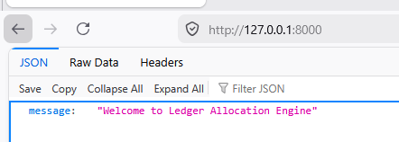
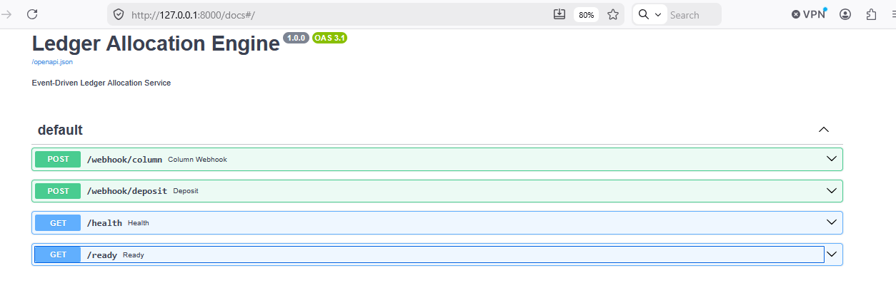
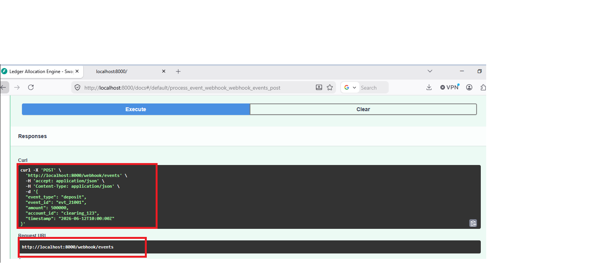
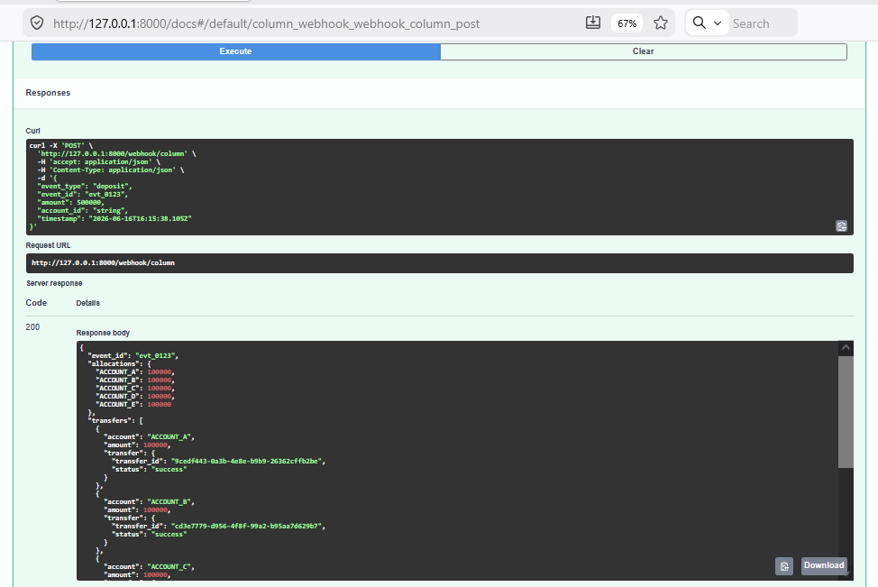
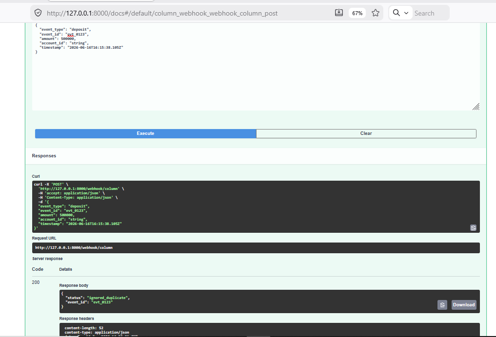
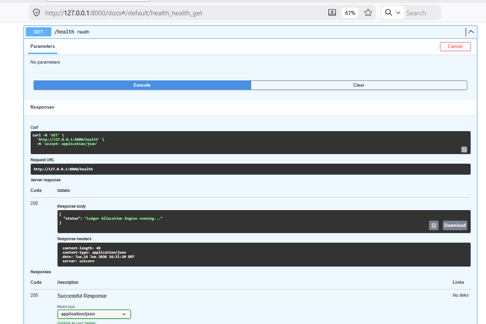

### Database Records

Processed events and ledger allocations successfully persisted in PostgreSQL.

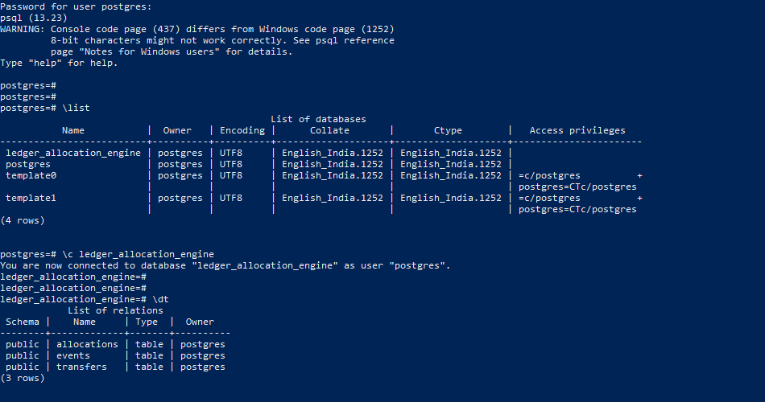

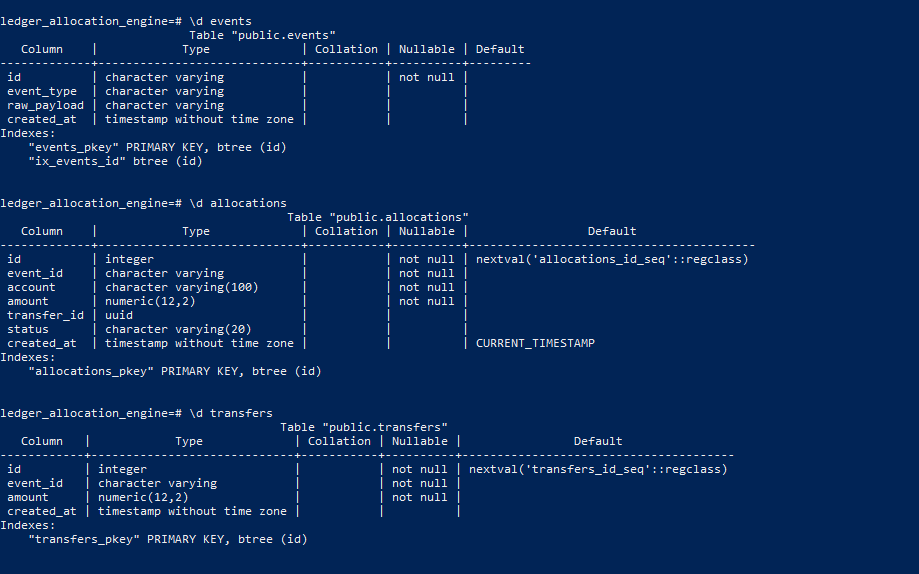

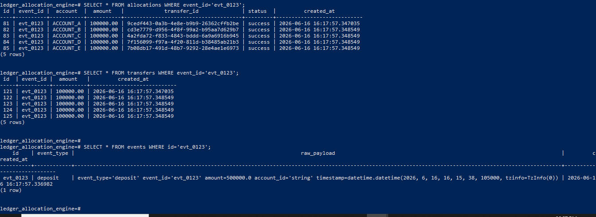

### Application Status

Health and readiness endpoints confirming service availability.

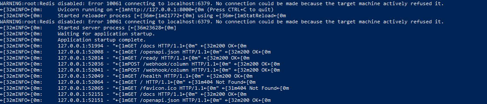

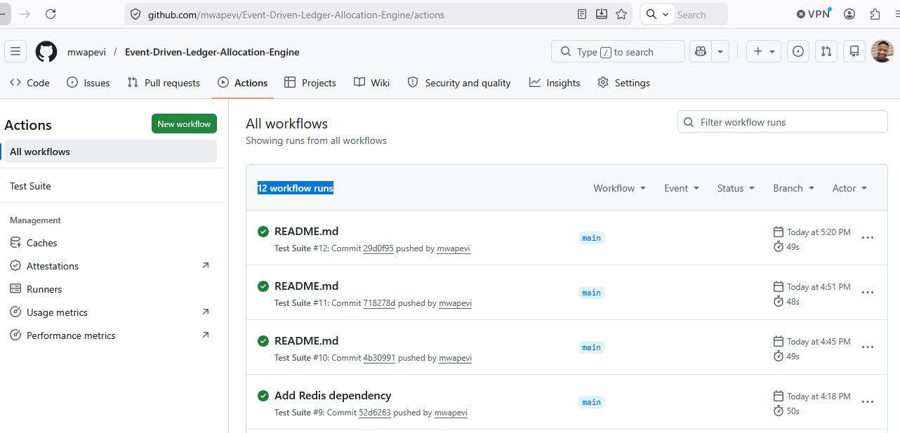

---

## Design Decisions

### Why Idempotency?

Webhook providers may deliver the same event multiple times.

Without idempotency protection, duplicate events could result in duplicate ledger allocations and inconsistent system state.

### Why Separate Services?

Business logic is intentionally kept outside route handlers to improve maintainability and make individual components easier to test.

### Why an Allocation Engine?

The allocation logic is isolated so that more sophisticated rules can be introduced later without changing the event-processing workflow.

---

## Future Improvements

Potential enhancements include:

* Authentication & Authorization
* Logging Service
* Notification service via Kafka-based event streaming
* Change Data Capture (CDC) with Debezium
* Redis distributed locking
* Dead-letter queue support
* Dynamic allocation rules
* Multi-tenant account configurations
* Prometheus metrics
* Grafana dashboards
* Kubernetes deployment
* Event sourcing patterns

---


## Disclaimer

This project is a portfolio demonstration of backend patterns commonly used in financial systems.

It does not process real funds, connect to banking networks, or interact with production payment providers.

---

## Author

**Victor Mwape**

GitHub: [mwapevi](https://github.com/mwapevi)

Areas of Interest:
- Backend Engineering
- Fintech Infrastructure
- Event-Driven Systems
- API Integrations
- Data Engineering
