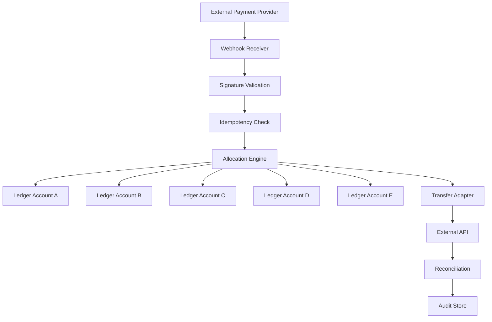

Include your Mermaid diagram:

ADDITIONAL::

# Event-Driven Ledger Allocation Engine Architecture

1. Column sandbox sends webhook on deposit
2. FastAPI receives webhook
3. Event processor validates idempotency
4. Allocation engine splits funds (Profit First model)
5. Transfer client executes book transfers
6. System logs all transfers for reconciliation